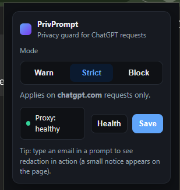
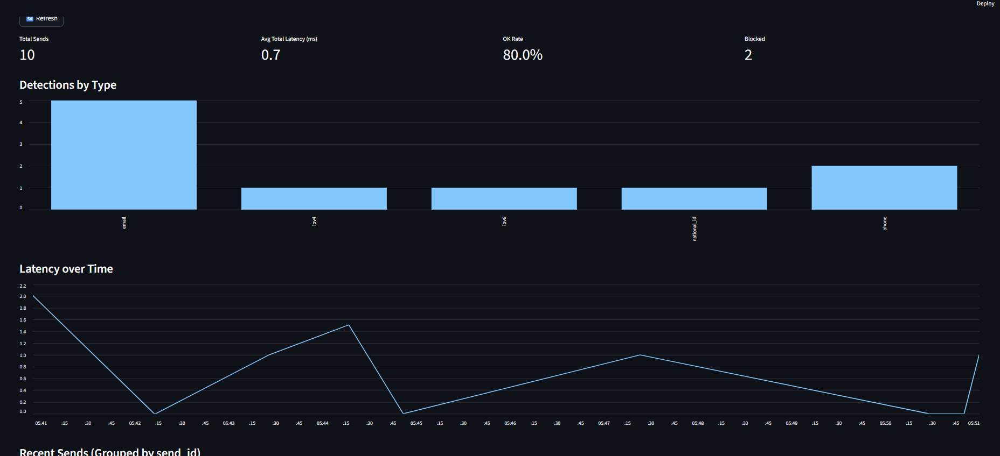
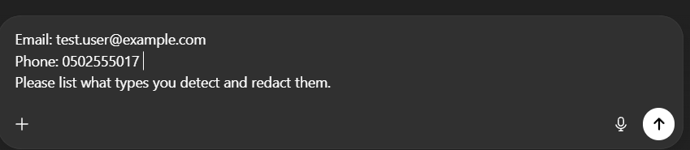
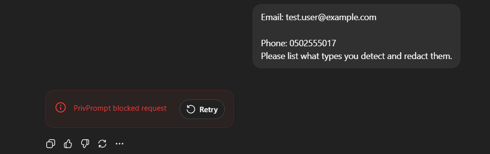
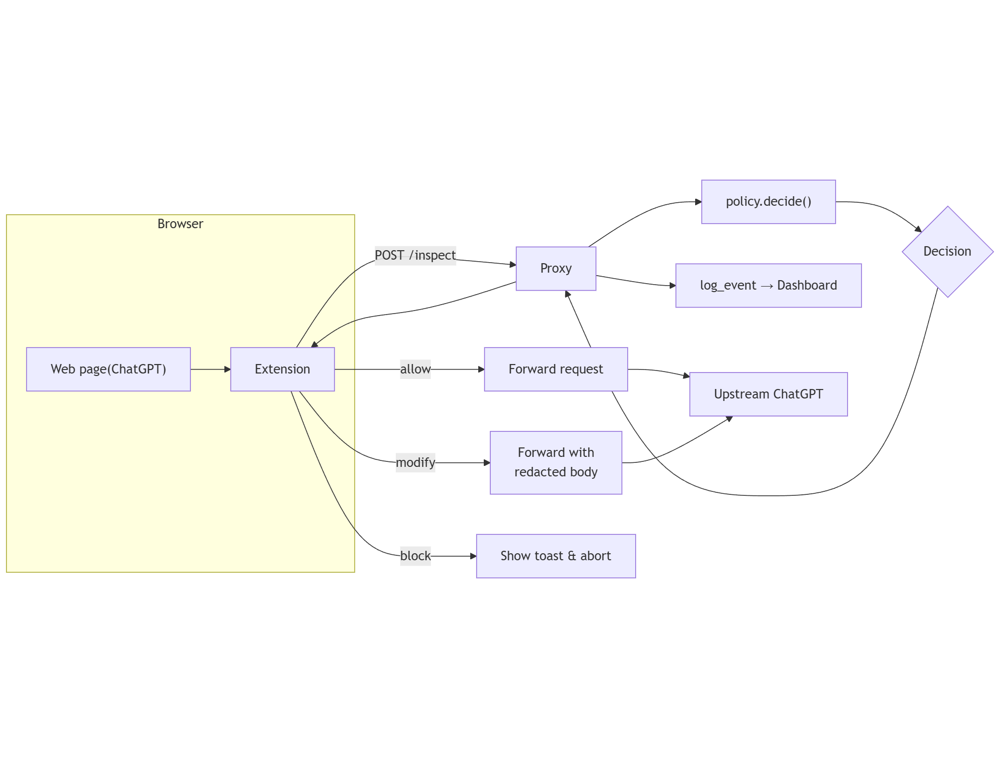

# PrivPrompt — Private AI Session Firewall (MVP)

A local privacy firewall for AI usage in the browser.

- Extension routes AI requests to a local proxy
- Proxy sanitizes prompts and forwards them upstream  
- Dashboard shows basic metrics (calls, detections, latency)

MVP scope: text JSON prompts only. File and image uploads are blocked by default.

---

## Screenshots (Running Product)

### Extension Toggle (Popup)


### Dashboard (Metrics + Detections)


---
## Redaction Demo (Before / After / Blocked)

### Before (Raw prompt contains sensitive data)


### After (Detected + redacted)


### Blocked (Request denied by policy)


---
## Architecture



**Data path**
1) Browser extension intercepts AI requests  
2) Requests are redirected to the local FastAPI proxy  
3) Proxy applies policy (detect/redact/block) and forwards upstream  
4) Proxy logs events to JSONL  
5) Streamlit dashboard reads JSONL and shows metrics

---

## Requirements

- Python 3.12.x (team standard)
- Chromium-based browser with Developer Mode enabled (Chrome, Edge, Brave, Atlas, etc.)

Verify Python version:

```bash
python --version
```

## Get the Code

```bash
git clone https://github.com/Ali-Mashni/PrivPrompt.git privprompt
cd privprompt
```
project layout
```bash
privprompt/
  extension/              # Browser extension (MV3)
    icons/
    manifest.json
    rules.json
    popup.html
    popup.js
    service_worker.js
    injected.js
    toast.css
  proxy/                  # Local proxy (FastAPI)
    app.py
    logs/                 # JSONL logs will appear here
  dashboard/              # Local dashboard (Streamlit)
    app.py
  docs/
  .gitignore
  .env                    # Created in setup
  requirements.txt
```
## Set Up Python (3.12) and Install Dependencies

Create and activate a virtual environment:

Windows (PowerShell)
```powershell
py -3.12 -m venv .venv
..venv\Scripts\Activate.ps1
```

macOS / Linux
```bash
python3.12 -m venv .venv
source .venv/bin/activate
```

Upgrade pip, then install dependencies:

```bash
python -m pip install --upgrade pip
pip install -r requirements.txt
```

## Create Environment File

From the repo root:

```bash
printf "PP_PORT=8787\nPP_LOG=proxy/logs/events.jsonl\n" > .env
```

Environment variables:

PP_PORT: Proxy port

PP_LOG: Path to JSONL metrics file read by the dashboard

.env is loaded automatically at runtime.

## Run Everything (Use Three Terminals)

### Terminal 1 — Proxy
venv must be active in this terminal

```bash
python -m dotenv run -- uvicorn proxy.app:app --reload --port 8787
```

Starts the proxy at: http://127.0.0.1:8787

### Terminal 2 — Dashboard
venv must be active in this terminal

```bash
python -m dotenv run -- streamlit run dashboard/app.py
```

Open the dashboard at: http://localhost:8501

### Terminal 3 — Browser Extension

Open your Chromium-based browser

Go to Extensions → enable Developer mode

Click Load unpacked and select the extension/ folder

Pin the extension and open the popup to see the Private AI Session toggle

